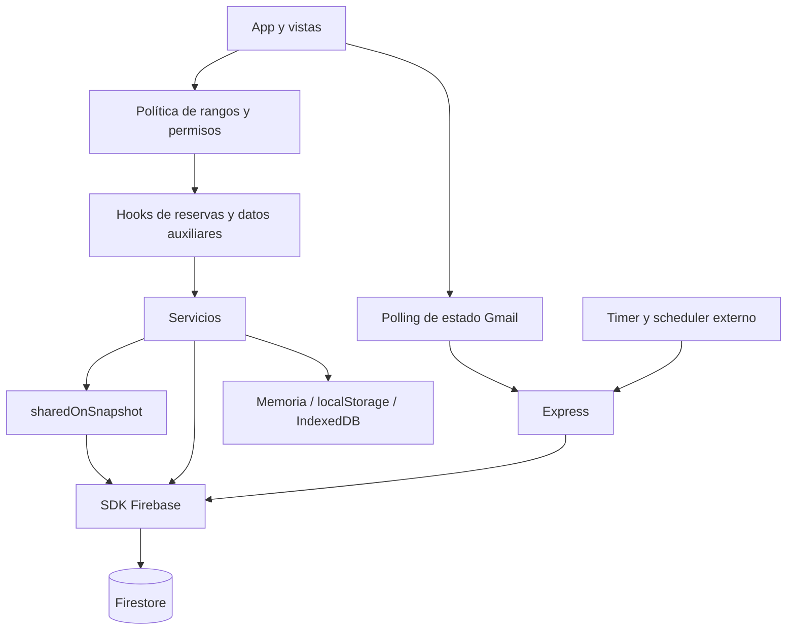

# Auditoría de lecturas Firestore y optimización de cuota

Fecha: 7 de octubre de 2026. Revisión estática del checkout actual, incluidos los tres archivos no versionados de agrupación de reservas que ya existían al comenzar. No se consultó producción, no se ejecutaron migraciones y no se modificó código, configuración, reglas ni datos. Las cifras numéricas son escenarios, no mediciones de facturación.

**Contexto confirmado por el responsable:** el sistema lo usan 6 personas: 3 con acceso total y 3 con acceso de solo lectura, sin edición. Este reparto 50/50 sustituye la mezcla hipotética 90/10 para evaluar el uso actual. Las simulaciones de 1–1.000 usuarios se conservan como comparación de crecimiento, no como tamaño real del sistema. El número de documentos de cuentas almacenadas y la cantidad de dispositivos/sesiones siguen sin medirse.

## 1. Resumen ejecutivo

La arquitectura ya incorpora ahorro significativo: reservas mensuales para lectores, historial bajo demanda, caché persistente, deduplicación de peticiones históricas, listeners compartidos y carga diferida de equipamiento y auditoría. No corresponde volver a presentar estas capacidades como mejoras pendientes.

El mayor riesgo encontrado está en el backend: el programador consulta configuración cada minuto y descarga **todas las reservas** cuando corresponde evaluar un despacho. Si no encuentra actividades elegibles, falla el envío o falla la persistencia de su marca de finalización, puede repetir la descarga cada minuto. Con 5.000 reservas y 930 intentos, son **4.650.000 lecturas de reservas** en el día, antes de otros accesos. Es un escenario condicional, confirmado como posibilidad por el código; su incidencia real requiere métricas.

Los siguientes focos son la ventana de reservas de editores sin límite futuro, la purga que lee todos los slots, las copias automáticas decididas con estado local por navegador y las lecturas de credenciales causadas indirectamente por el polling de Gmail. El contador local no cubre estos accesos del servidor.

### Cuotas y condiciones verificadas

| Firestore Standard, base elegible | Cuota gratuita publicada |
|---|---:|
| Document reads | 50.000/día |
| Document writes | 20.000/día |
| Document deletes | 20.000/día |
| Datos almacenados | 1 GiB |
| Transferencia saliente | 10 GiB/mes |

La cuota diaria se reinicia aproximadamente a medianoche del Pacífico. No hay un cupo mensual de document reads equivalente que permita compensar días excedidos. Firebase publica una sola base elegible por proyecto. El dashboard de uso puede diferir de la facturación final. [Cuotas oficiales](https://firebase.google.com/docs/firestore/quotas).

La base configurada tiene un ID distinto de `(default)`. Hay una discrepancia entre fuentes oficiales: Firebase indica que la primera base creada puede ser elegible independientemente de su ID; la página de Google Cloud indica que las bases con nombre no califican. Por ello **no se certifica la elegibilidad desde el repositorio**. Deben confirmarse edición, plan, región y asignación efectiva de cuota en la consola/facturación antes de prometer costo cero. [Firebase](https://firebase.google.com/docs/firestore/pricing), [Google Cloud](https://cloud.google.com/firestore/pricing).

Spark ofrece límites sin pago; Blaze permite consumo facturado. No se debe interpretar Spark como pago automático por excedente. Cloud Functions no está incluida en Spark; no se recomienda introducirla como requisito de estas mejoras. [Planes de Firebase](https://firebase.google.com/pricing), [Comportamiento de los planes](https://firebase.google.com/docs/projects/billing/firebase-pricing-plans).

Como referencia y **no como tarifa del proyecto**, la tabla oficial consultada para Iowa (`us-central1`), consumo Default sin compromiso, muestra USD 0,03/100.000 reads, 0,09/100.000 writes y 0,01/100.000 deletes. La región real no está declarada aquí. Costo de reads = reads facturables excedentes / 100.000 × tarifa regional; si la base no es elegible, no descontar 50.000. Añadir almacenamiento, tráfico y otros servicios. [Tarifas oficiales](https://cloud.google.com/firestore/pricing).

Las copias de esta aplicación son documentos y fragmentos ordinarios en `copias_seguridad`; no son el servicio nativo de backups/PITR. Su costo deriva de las consultas, documentos escritos, almacenamiento y tráfico. Las restricciones del servicio nativo no deben aplicarse por confusión a estas copias.

## 2. Arquitectura Firestore

Frontend React 19 → `App` y hooks → servicios → SDK modular Firebase 12 → base con nombre configurada en `firebase-applet-config.json`. Backend Express → SDK de cliente Firebase, **no Firebase Admin** → misma base. No se encontró un directorio ni despliegue de Cloud Functions. `firebase.json` declara reglas y emuladores; no declara un archivo de índices. La ausencia de ese archivo no demuestra que no existan índices desplegados.



| Colección/documento | Datos y relación | Flujos consumidores |
|---|---|---|
| `reservas/{id}` | Fecha, espacio, responsable, actividad, versiones, referencias de serie/reemplazo | Calendario, horario, agenda, conflictos, estadísticas, formularios, despacho, respaldo |
| `schedule_slots/{fecha_espacio}` | Ocupación de espacios por día, IDs de reservas | Transacciones, reconstrucción y purga |
| `usuarios_sistema/{username}` | Cuenta, rol, permisos y hash de contraseña | Login, App, autorización local, administración |
| `configuracion_sistema/{id}` | `espacios`, `tipos_prestamo`, `tipos_actividad`, `equipamiento`, programación, credenciales Gmail y logs de envío | Listener general, equipamiento, Gmail, respaldo, backend |
| `calificaciones_espacios/{id}` | Referencia de reserva y campos descriptivos ya duplicados | Evaluaciones, mantenimiento, detalle y aviso del lunes |
| `bloqueos_espacios/{id}` | Intervalo, espacio, motivo y activo | Hook global de bloqueos y vistas |
| `audit_logs/{id}` | Cambios, estados y reversión | Modal de auditoría y restauración |
| `fcm_notificaciones/{id}` | Mensaje, fecha y dispositivo emisor | Notificaciones después del login |
| `fcm_tokens/{deviceId}` | Registro de dispositivo/token | Escrituras FCM; listener de dispositivos sin consumidor encontrado |
| `copias_seguridad/{id}/partes/{parteId}` | Metadatos y payload serializado por fragmentos | Importación/exportación, descarga, restauración y rotación |
| `_connection_test/ping` | Sonda | Función exportada sin consumidor encontrado |
| `reservas_comunitarias_v2/{id}` | Colección antigua bloqueada | Todavía intentada por validación backend de evaluaciones |

Los IDs de slots ya son determinísticos; no hay un join por fila para usuario, sala y actividad. Directorio de solicitantes y búsquedas derivan de las reservas disponibles. La caché e instrucciones locales de permisos no equivalen a control de acceso en reglas.

## 3. Inventario de consultas

Raíz de archivos: el workspace `espacios-comunitario`. Líneas verificadas en el checkout auditado. `Q(x)=max(1, x)` para consultas de servidor; `L(x)=Q(x)+Δ+RC`, donde Δ son cambios facturables y RC reconexiones. Para un `getDoc` de servidor presupuestar 1 incluso si falta el documento. `getDoc/getDocs` normales pueden resolver desde caché; las fórmulas muestran el costo cuando acceden al servidor, no una garantía de facturación por cada invocación.

Variables: N=reservas totales, A=ventana activa, M=reservas del rango visible, H=historial solicitado, U=usuarios, C=configuración, B=bloqueos, R=evaluaciones, F=notificaciones, S=slots, E=slots vacíos antiguos, P=fragmentos de backup, T=IDs de una operación, V=versiones adicionales protegidas, J=reemplazos enlazados, K=slots afectados, a=número de ejecuciones de un callback transaccional. No confundir T con N.

### Frontend y servicios

| ID | Archivo:línea / función | Consulta y colección | Consumidor / frecuencia | Docs / reads potenciales | Clase |
|---|---|---|---|---|---|
| DB-001 | `src/services/reservationService.ts:667` subscribeToReservations | reservas, fecha ≥ hoy−30, order fecha, sin máximo futuro | Editores; lectores en vistas generales, búsqueda global y modales; cambios de alcance | A / L(A) por suscripción | ALTA |
| DB-002 | `src/services/reservationService.ts:776` subscribeToReservationsByDateRange | reservas, inicio ≤ fecha ≤ fin | Lectores, calendario/daily/timeline/mobile; cambio de rango | M / L(M) | ÓPTIMA, medir reaperturas |
| DB-003 | `src/services/reservationService.ts:839` fetchReservationsByDateRange | reservas, rango ordenado | Historial calendario; petición exacta deduplicada y TTL 60 min | H / 0 si fresco, Q(H) si servidor | ÓPTIMA con solapamientos |
| DB-004 | `src/services/reservationService.ts:966` fetchReservationById | reservas/id | Recordatorio si falta original y acción de abrir relacionada | 1 / 1 por petición servidor | BAJA |
| DB-005 | `src/services/reservationService.ts:1016` seedAllToFirestore | Todas las reservas | Sincronización manual/restauración; hash puede omitir | N / Q(N), más DB-030…035 | ALTA, manual |
| DB-006 | `src/services/reservationService.ts:1034` reloadAllFromFirestore | Todas las reservas | Exportada; sin consumidor encontrado | N / Q(N) si se invoca | POTENCIAL |
| DB-007 | `src/services/reservationService.ts:1068` queryReservationsByDate | reservas, fecha == día | checkFirestoreAvailability; sin consumidor externo encontrado de esta ruta | Reservas del día / Q(día) | POTENCIAL |
| DB-008 | `src/services/reservationService.ts:1095` queryReservationsByDateRange | reservas, fecha entre límites, espacio opcional, order fecha/hora | Exportada; sin consumidor encontrado | Rango / Q(rango)+índices potenciales | POTENCIAL |
| DB-009 | `src/services/reservationService.ts:1119` queryReservationsBySeries | reservas, serieRecurrente == ID, fecha mínima opcional | CRUD de series, excepciones, conversiones y App | Serie / Q(serie) por acción | MEDIA, necesaria |
| DB-010 | `src/services/authService.ts:352` subscribeToUsers | Todos usuarios_sistema | App, LoginScreen, PasswordPromptModal; referencia compartida | U / L(U), no U×componentes | MEDIA/ALTA al crecer |
| DB-011 | `src/services/authService.ts:592` changeUserPassword | Todos usuarios_sistema | Solo si cuenta no existe localmente | U / Q(U) por fallback | MEDIA |
| DB-012 | `src/services/authService.ts:657` resetUsersToDefault | Todos usuarios_sistema | Reset administrativo para borrar/restablecer | U / Q(U) por acción | BAJA frecuencia |
| DB-013 | `src/services/authService.ts:709` authenticateUser | Usuario por ID saneado | Login cuando falta cuenta en caché | 1 / 1 | ÓPTIMA en alcance |
| DB-014 | `src/services/authService.ts:804` authenticateByPasswordAsync | Todos usuarios_sistema | PasswordPromptModal, si no coincide contraseña local | U / Q(U) por intento fallido/fallback | MEDIA/ALTA |
| DB-015 | `src/services/adminConfigService.ts:186` subscribeToAdminConfig | Toda configuracion_sistema | useAdminConfig desde montaje, incluso login | C / L(C); procesa solo 3 IDs | MEDIA |
| DB-016 | `src/services/equipmentService.ts:194` subscribeToEquipment | configuracion_sistema/equipamiento | Formulario o pestaña equipamiento | 1 / L(1); solapa DB-015 | BAJA |
| DB-017 | `src/services/auditLogService.ts:317` subscribeToAuditLogs | audit_logs, timestamp desc, limit150 | Solo modal auditoría abierto | min(logs,150) / L(resultado) | MEDIA, acotada |
| DB-018 | `src/services/auditLogService.ts:633` purgeAuditLogs | Todos audit_logs | Botón de purga; reglas niegan delete | Todos logs / Q(logs), borrados rechazados | ALTA si se usa |
| DB-019 | `src/services/ratingService.ts:317` subscribeToRatings | calificaciones_espacios, limit150 sin orden de fecha | Editores; lectores en vistas/modales habilitados | min(R,150) / L(resultado) | MEDIA; revisar cobertura |
| DB-020 | `src/services/spaceBlockService.ts:71` subscribeToSpaceBlocks | Todos bloqueos_espacios | Hook global, incluso antes login | B / L(B) | MEDIA/ALTA al crecer |
| DB-021 | `src/services/fcmService.ts:408` subscribeToFcmBroadcasts | fcm_notificaciones, createdAt desc, limit15 | Después login, recreada al cambiar objeto currentUser | min(F,15) / L(resultado) | BAJA/MEDIA |
| DB-022 | `src/services/fcmService.ts:449` subscribeToRegisteredDevices | Todos fcm_tokens | Exportada; sin consumidor encontrado | Dispositivos / L(dispositivos) si se invoca | POTENCIAL |
| DB-023 | `src/services/backupService.ts:259` createDatabaseBackup | Todas reservas, salvo customReservations | Copia manual o automática por navegador al vencer 15 días | N / Q(N) por copia | ALTA |
| DB-024 | `src/services/backupService.ts:502` getDatabaseBackupsList | copias_seguridad, timestamp desc, limit50 | Abrir modal, refrescar acciones, rotación | min(backups,50) / Q(resultado) | MEDIA |
| DB-025 | `src/services/backupService.ts:566` fetchFullBackupRecord | copias_seguridad/id | Descargar/restaurar backup | 1 / 1 | BAJA |
| DB-026 | `src/services/backupService.ts:602` fetchFullBackupRecord | partes del backup | Si metadatos no traen payload inline | P / Q(P) | Necesaria, bajo demanda |
| DB-027 | `src/services/backupService.ts:704` deleteDatabaseBackup | partes del backup | Borrar copia / rotación FIFO | P / Q(P) por backup borrado | Necesaria con modelo actual |
| DB-028 | `src/services/gmailDispatchService.ts:523` loadGmailDispatchConfig | configuracion_sistema/gmail_dispatch_config | AdminGmailConfig al montar; GmailDispatchModal al abrir | 1 / 1 por carga servidor | BAJA, duplicación potencial |
| DB-029 | `src/firebase/config.ts:61` testFirestoreConnection | _connection_test/ping, getDocFromServer | Sin consumidor encontrado | 1 / 1 si se invoca | POTENCIAL |

### Escrituras transaccionales y backend

| ID | Archivo:línea / función | Lectura | Disparador / frecuencia | Docs / reads potenciales | Clase |
|---|---|---|---|---|---|
| DB-030 | `src/services/reservationWriter.ts:136` writeReservations | getDoc por ID de reservas | Preflight de múltiples IDs no-create, y borrados | T / T | MEDIA/ALTA en lote |
| DB-031 | `src/services/reservationWriter.ts:151` callback transacción | tx.get reservas de chunk | Cada intento transaccional, incluso create | Tchunk / a×Tchunk | Esencial |
| DB-032 | `src/services/reservationWriter.ts:152` callback transacción | tx.get slots entrantes únicos | Cada intento | Kentrada / a×Kentrada | Esencial |
| DB-033 | `src/services/reservationWriter.ts:157` callback transacción | tx.get reservas expectedVersions no presentes | Cada chunk/intento, guards no confirmados | V / a×V, posible repetición | MEDIA |
| DB-034 | `src/services/reservationWriter.ts:171` callback transacción | tx.get reservas de reemplazo enlazadas | Cada chunk/intento | J / a×J | Esencial |
| DB-035 | `src/services/reservationWriter.ts:210` callback transacción | tx.get slots viejos no leídos como entrantes | Mover/borrar/editar; cada intento | Kresto / a×Kresto | Esencial |
| DB-036 | `server.ts:99` GmailConnection.store.read | getDoc credenciales Gmail | status, tokens, conectar/desconectar; status por navegador/minuto si OAuth configurado | 1 / 1 por acceso servidor | ALTA por frecuencia |
| DB-037 | `server.ts:506` executeScheduledDispatchInternal | getDoc config despacho | Arranque + timer 60s + scheduler HTTP; singleFlight en proceso | 1 / ~1.440/día/instancia más externos | MEDIA/ALTA |
| DB-038 | `server.ts:446` fetchAllReservationsServer | getDocs todas reservas con retry | Despacho elegible y preview; vuelve a intentarlo si no termina | N / Q(N)×intentos | CRÍTICA condicional |
| DB-039 | `server.ts:470` fetchAllRatingsServer | Todas evaluaciones con retry | Función definida sin consumidor encontrado | R / Q(R) si se invoca | POTENCIAL |
| DB-040 | `server.ts:1011` preview-scheduled | getDoc config despacho | Cada petición preview desde administración | 1 / 1, más DB-038 | MEDIA/ALTA por N |
| DB-041 | `server.ts:752` purgeExpiredSlotsServer | Todas schedule_slots | Arranque, cada24 h, endpoint disparado por editores semanalmente por navegador | S / Q(S) por ejecución | ALTA |
| DB-042 | `server.ts:770` purga transacción | tx.get slots candidatos antes borrar | Por lote400, cada intento | E / a×E | Esencial para no borrar ocupados |
| DB-043 | `server.ts:1103` validate-and-save | getDoc colección antigua/id | Cada evaluación con targetReservation | 1 intento; acceso denegado con reglas actuales | Desperdicio/falla de validación |
| DB-044 | `server.ts:1105` validate-and-save | getDoc reservas/id | Solo si lectura anterior devuelve missing, no si lanza permiso denegado | 1 / 1 cuando alcanzable | Necesaria; ruta defectuosa |

### Scripts y migraciones (no ejecutados)

| ID | Archivo:línea / función | Consulta | Frecuencia | Docs / reads potenciales | Clase |
|---|---|---|---|---|---|
| DB-045 | `src/services/migrations/rebuildScheduleSlots.ts:20` rebuildScheduleSlots | Todas reservas | Manual, script actual usa demo+emulador | N / Q(N) por pasada | Fuera sesión normal |
| DB-046 | `src/services/migrations/rebuildScheduleSlots.ts:21` rebuildScheduleSlots | Todos slots | Igual, incluso modo comprobar | S / Q(S) | Fuera sesión normal |
| DB-047 | `scripts/group-independent-reservations.ts:17` preview/apply | getDocsFromServer todas reservas | Manual; apunta a config real incluso sin --apply | N / Q(N) | ALTA, manual |
| DB-048 | `scripts/group-independent-reservations.ts:38` verificación | getDocsFromServer todas reservas | Una vez tras --apply | N / Q(N) | ALTA, manual |
| DB-049 | `src/services/migrations/groupIndependentReservations.ts:69` applyIndependentReservationGroup | transaction.get cada reserva del grupo | Por grupo de 2…400, intentos a | Grupo / a×grupo | Necesaria, manual |

Los wrappers `getDocWithRetry` (`server.ts:404`) y `getDocsWithRetry` (`server.ts:423`) permiten hasta dos llamadas para fallos transitorios; las líneas de retorno posteriores al bucle no añaden una tercera llamada en su recorrido normal. No se suma una consulta adicional por el wrapper ni por `sharedOnSnapshot` (`src/firebase/sharedSnapshot.ts:53`): son la implementación de las operaciones anteriores.

### Inventario de escrituras y efectos sobre reads

| Subsistema | Operaciones | Lecturas y efectos |
|---|---|---|
| Reservas | `tx.set` reservas/slots, `tx.delete` reservas; chunks hasta 450 operaciones previstas y8MB | DB-030…035 más actualizaciones hacia cada listener interesado; un batch no elimina lecturas transaccionales |
| Usuarios | set/batch guardar-renombrar, delete, seed/default reset | Reset lee U; el resto no consulta siempre; generan eventos DB-010 |
| Configuración/equipamiento | setDoc, reset en writeBatch | Sin lectura explícita previa habitual; general C escucha también cambios de equipamiento/Gmail/logs |
| Auditoría | setDoc de evento/reversión; purge batch.delete | Evento ordinario no lee colección; purge lee logs y después es denegado |
| Evaluaciones | setDoc desde backend y luego frontend, deleteDoc, cola offline | Puede haber dos writes por guardado y dos eventos remotos; DB-043/044 para validación |
| Backups | set de P partes + metadatos + configuración; delete partes y padre | DB-023/024/027; la rotación se inicia tras cada copia |
| FCM | setDoc token y broadcast | Sin query de existencia previa; cada broadcast puede producir lecturas en navegadores conectados |
| Backend Gmail | set credenciales, last_email_dispatch, config de último envío | Cada cambio también alcanza DB-015 en clientes |
| Migraciones | cleanMinuteConflicts usa batch sin reads explícitas; rebuild usa batch después N+S; agrupación usa transaction.update+audit.set | Distinguir deletes/writes de reads; posible fanout de eventos, fuera del flujo normal |

No se encontraron usos operativos de `getCountFromServer`, `collectionGroup`, `startAfter`, agregaciones nativas, `addDoc` o `updateDoc`. Los `transaction.update` sí existen en agrupación. Imports o comentarios no se contabilizan como ejecución.

## 4. Top consumidores de lecturas

Ranking del **escenario base para los 6 usuarios confirmados**: 3 lectores y 3 con acceso total, una sesión/día, servidor único, despacho exitoso una vez, sin backups ese día ni reconexiones. Total=13.534 reads de documentos estimados. Se conservan las cardinalidades hipotéticas de la sección 17, incluidas 20 cuentas almacenadas; si la colección contiene solo 6 cuentas, el total baja a 13.450. Es un ranking simulado, no el consumo observado.

| Ranking | Función/flujo | Reads/día | % |
|---:|---|---:|---:|
| 1 | Una carga de reservas para despacho, DB-038 | 5.000 | 36,94 |
| 2 | Ventana general de tres editores, DB-001 | 2.700 | 19,95 |
| 3 | Purga diaria de slots, DB-041 | 2.000 | 14,78 |
| 4 | Polling configuración backend, DB-037 | 1.440 | 10,64 |
| 5 | Dos rangos de calendario por cada lector, DB-002 | 1.200 | 8,87 |
| 6 | Evaluaciones en editores, DB-019 | 450 | 3,32 |
| 7 | Polling Gmail de seis navegadores, DB-036 | 186 | 1,37 |
| 8 | Listener global de bloqueos, DB-020 | 180 | 1,33 |
| 9 | Listener usuarios, DB-010 | 120 | 0,89 |
| 10 | Notificaciones iniciales, DB-021 | 90 | 0,66 |
| 11 | Configuración general, DB-015 | 60 | 0,44 |
| 12 | Cambios facturables en listeners, supuesto Δ | 60 | 0,44 |
| 13 | Cinco acciones por editor, slots/reserva, DB-031/032 | 45 | 0,33 |
| 14 | Equipamiento por editor, DB-016 | 3 | 0,02 |

No se inventan seis consumidores adicionales para completar20. Backups, preview, auditoría y operaciones masivas tienen costo cero **en este escenario**, no en todo uso. Su costo es Q(N), Q(logs), Q(S) o Q(P) por activación y puede alterar completamente el ranking. El P0 sustituye la fila 1 por millones; no se mezcla con el día exitoso.

Las cuatro primeras filas suman 82,31% del escenario base para seis usuarios. El foco es extracción para despacho, ventana de editores, purga y polling del servidor; no es una estadística de líneas de código ni una medición de producción. El backend representa 8.440 de 13.534 reads (62,36%) en este día supuesto, por lo que optimizar solo a los tres lectores no resuelve el mayor consumo.

## 5. Problemas P0

### READ-001 — Descarga completa repetida por el scheduler

**Archivo:** `server.ts:446`, `server.ts:506`, `server.ts:561`, `server.ts:803`. **Función:** fetchAllReservationsServer / executeScheduledDispatchInternal. **Colección:** reservas y configuracion_sistema. **Tipo de operación:** getDocs completo + polling getDoc. **Frecuencia:** cada minuto elegible hasta persistir despacho exitoso; multiplicada por instancias/schedulers. **Documentos recuperados:** N por intento. **Reads estimadas:** Q(N)×k + comprobaciones de config; retries pueden ampliar.

**Problema:** no actividades, envío fallido o marca de finalización no persistida dejan habilitada la siguiente descarga total. **Causa:** filtrado posterior en memoria y singleFlight solo mientras una ejecución está en curso, dentro de un proceso. **Impacto:** CRÍTICO condicional; 5.000×930=4.650.000 reads de reservas, unas93 cuotas diarias. **Solución:** consultar exclusivamente activityDates; preservar selectDispatchReservations, referencia de semana, modalidad y todos los candidatos necesarios. Después incorporar coordinación duradera por fecha/configuración y control explícito de reintentos, sin marcar envío fallido como exitoso ni impedir actividades recién creadas.

**Reads antes:** k×Q(N). **Reads después:** manteniendo cada minuto, k×sum(Q(reservas por fecha solicitada)); no requiere retrasar despacho. **Ahorro estimado:** supuesto40 documentos elegibles de fecha por pasada:4.650.000→37.200;4.612.800 menos (99,2%). Se conserva una consulta por cada fecha vacía. Un backoff puede ahorrar adicionalmente, sujeto al requisito de actualización; no se suma ese ahorro aún. **Dificultad:** media; alta para coordinación distribuida. **Riesgo del cambio:** medio. **Evidencia:** CONFIRMADO el patrón; REQUIERE MÉTRICAS la frecuencia real. **Prioridad:** P0. **Contrato/índice:** helper backend por fechas con SDK query/where; validar índice de fecha. Coordinación requeriría documento privado de estado y control de acceso, una fase posterior.

### READ-002 — Acceso público permite consumo ajeno a los flujos previstos

**Archivo:** `firestore.rules:132` y bloques de colecciones; `server.ts:900`. **Función:** allow read y requireAuth. **Colección:** todas las colecciones permitidas por reglas. **Tipo de operación:** lectura directa posible por SDK/API. **Frecuencia:** no acotada por estos flujos. **Documentos recuperados:** cualquier conjunto permitido. **Reads estimadas:** no determinables desde sesiones legítimas.

**Problema:** las reglas permiten lecturas públicas y writes con validación de forma, sin autorización de usuario; el middleware acepta payload base64 sin firma y, en fallback, cadenas de longitud≥20. **Causa:** roles/autenticación propios en cliente, no enlazados a autorización fiable en reglas/backend. **Impacto:** exposición y consumo fuera del presupuesto; un frontend optimizado no controla el proyecto completo. **Solución:** diseñar autenticación verificable y autorización por rol; proteger credenciales/cuentas y endpoints de mantenimiento. No retirar listeners de permisos para simular seguridad.

**Reads antes:** sin techo fiable. **Reads después:** consumo de acciones autorizadas más dependencias de reglas que se incorporen. **Ahorro estimado:** REQUIERE MÉTRICAS; no se inventa porcentaje. **Dificultad:** alta. **Riesgo del cambio:** alto por migración de identidad. **Evidencia:** CONFIRMADO en reglas del repositorio; despliegue real pendiente. **Prioridad:** P0 de seguridad y control de cuota, no P0 por volumen demostrado. **Contrato/índice:** reemplazar sesión no verificable por identidad validada y reglas coordinadas; migración separada, no automática.

No se encontró una consulta Firestore ejecutada directamente durante render ni un bucle de listeners sin cierre. No se asignan P0 ficticios por esos patrones.

## 6. Problemas P1

### READ-003 — Ventana general incluye todo el futuro

**Archivo:** `src/services/reservationService.ts:667`; `src/utils/reservationReadScope.ts:17`; `src/App.tsx:224`. **Función:** subscribeToReservations/getReservationReadScope. **Colección:** reservas. **Tipo de operación:** listener por fecha mínima. **Frecuencia:** login de editor y entrada de lector en alcance general. **Documentos recuperados:** A=pasado reciente+todo futuro. **Reads estimadas:** L(A) por nueva suscripción.

**Problema:** reducir30 días de pasado no restringe recurrencias futuras; daily/timeline también usan un mes completo para lectores. **Causa:** una fuente global alimenta vistas y validaciones locales. **Impacto:** ALTO, proporcional al horizonte futuro y cambios recibidos. **Solución:** alcance visible para editores y vistas diarias, manteniendo carga explícita para series, conflictos, exportaciones y acciones generales. Conservar comprobaciones transaccionales de slots y pantalla bloqueada hasta confirmar un rango requerido.

**Reads antes:**900/editor/suscripción en base. **Reads después:**200 para rango mensual supuesto, más cargas de acciones necesarias. **Ahorro estimado:**700 (77,78%) por editor en visita exclusivamente mensual;3.500 para 5 editores, antes de acciones adicionales. **Dificultad:** media/alta. **Riesgo del cambio:** alto si se recorta la fuente sin adaptar consumidores. **Evidencia:** CONFIRMADO alcance; OPTIMIZACIÓN POTENCIAL neta. **Prioridad:** P1. **Contrato/índice:** política de rango y funciones explícitas para datos completos, no limit arbitrario.

### READ-004 — Purga descarga todos los slots

**Archivo:** `server.ts:752`, `server.ts:770`, `server.ts:810`; `src/services/reservationService.ts:1279`. **Función:** purgeExpiredSlotsServer/purgeExpiredScheduleSlots. **Colección:** schedule_slots. **Tipo de operación:** getDocs completo+transacción. **Frecuencia:** arranque,24 h e invocación semanal por cada navegador editor. **Documentos recuperados:** S y después E. **Reads estimadas:** Q(S)+a×E por ejecución.

**Problema:** lee también slots futuros y antiguos ocupados, aunque solo elimina vacíos anteriores al corte. **Causa:** filtro ID/ocupación en memoria y throttles locales, no coordinados globalmente. **Impacto:** ALTO al acumular slots ocupados históricos. **Solución:** restringir por ID ordenado al prefijo anterior a cutoff, paginar candidatos y conservar recheck transaccional de vacío; una ejecución coordinada en servidor. Campo canónico de fecha/vacío solo si el ahorro adicional justifica una migración.

**Reads antes:**2.000+E. **Reads después:**si40 slots antiguos candidatos,40+a×E. **Ahorro estimado:**1.960 (98%) sobre escaneo; no cambia el recheck. **Dificultad:** media. **Riesgo del cambio:** medio. **Evidencia:** CONFIRMADO; REQUIERE MÉTRICAS candidatos. **Prioridad:** P1. **Contrato/índice:** query por documentId con orden/cursor; conservar isPurgeableScheduleSlot. No borrar ocupados para reducir almacenamiento.

### READ-005 — Copias automáticas independientes por navegador

**Archivo:** `src/services/backupService.ts:135`, `src/services/backupService.ts:259`, `src/services/backupService.ts:425`; `src/App.tsx:401`. **Función:** checkAndRunScheduledBackup/createDatabaseBackup. **Colección:** reservas/copias_seguridad/configuracion_sistema. **Tipo de operación:** getDocs completo y writes fragmentados. **Frecuencia:** primer editor con estado local vencido, luego checks4h; default enabled y timestamp0 en navegador nuevo. **Documentos recuperados:** N por copia, hasta 50 para rotación y P por copia vieja borrada. **Reads estimadas:** b×[Q(N)+Q(backups)+sum(Q(Pviejo))].

**Problema:** configuración escrita en Firestore pero la decisión automática se toma de localStorage; el listener general solo aplica los 3 documentos de catálogo. Varios dispositivos pueden considerar vencida la misma copia. **Causa:** reloj de último backup no autoritativo ni claim compartido. **Impacto:** ALTO en día vencido/primer uso;5 navegadores×5.000=25.000 reads solo de reservas. **Solución:** estado autoritativo compartido y exclusión por ciclo, ID determinístico y confirmación de payload antes de finalizar ciclo. Mantener lectura completa de reservas para un backup completo: el array activo de App no es sustituto válido.

**Reads antes:**25.000+rotaciones, supuesto5 copias duplicadas. **Reads después:**5.000+coste de coordinación+una rotación. **Ahorro estimado:**20.000 de lecturas de reservas (80%); descontar coordinación al medir. **Dificultad:** media/alta. **Riesgo del cambio:** medio/alto. **Evidencia:** CONFIRMADO diseño local; MUY PROBABLE duplicación entre dispositivos. **Prioridad:** P1. **Contrato/índice:** ciclo/estado/claim privado, reglas y recuperación ante fallo; no añadir Cloud Functions obligatoriamente.

## 7. Problemas P2

### READ-006 — Estado Gmail produce una lectura backend por minuto/navegador

**Archivo:** `src/App.tsx:519`, `src/services/gmailDispatchService.ts:111`, `server/gmailConnection.ts:60`, `server.ts:99`. **Función:** initGmailAuthListener→restoreGmailConnection→status→storedCredential. **Colección:** configuracion_sistema/gmail_oauth_credentials. **Tipo de operación:** HTTP indirecto a getDoc. **Frecuencia:** montaje, cada60s, foco y acciones; incluso login. **Documentos recuperados:**1 por status cuando OAuth configurado. **Reads estimadas:**g×(1+minutos+focos+acciones), g=0/1.

**Problema:** la deduplicación frontend solo comparte peticiones simultáneas; no cachea el resultado entre minutos/usuarios. **Causa:** storedCredential lee en cada status sin TTL. **Impacto:** MEDIO/ALTO por multiplicación. **Solución:** caché privada backend del estado/credencial, singleFlight y TTL breve; invalidar conectar/desconectar/refresh. Ejemplo conservador: TTL de 60 s mantiene polling y frescura, compartiendo en una instancia; no enviar secretos al cliente.

**Reads antes:**1.550 para 50 sesiones solapadas de 30 min. **Reads después:**~31 por instancia para esas mismas sesiones solapadas con caché60s. **Ahorro estimado:**1.519 (98%); sesiones no solapadas ahorran menos. **Dificultad:** baja/media. **Riesgo del cambio:** medio por desconexión entre instancias. **Evidencia:** CONFIRMADO ruta; REQUIERE MÉTRICAS configuración OAuth y concurrencia. **Prioridad:** P2, P1 con alto uso. **Contrato/índice:** API pública de status igual; caché solo servidor, revocación acotada al TTL o evento compartido.

### READ-007 — Configuración general lee documentos no utilizados

**Archivo:** `src/services/adminConfigService.ts:186`, `src/hooks/useAdminConfig.ts:93`. **Función:** subscribeToAdminConfig. **Colección:** configuracion_sistema. **Tipo de operación:** listener completo. **Frecuencia:** montaje App, antes login. **Documentos recuperados:**C aunque procesa3 IDs. **Reads estimadas:**L(C), incluidos cambios OAuth, despacho y backup no visibles.

**Problema:** catálogo comparte colección con datos operativos; equipamiento recibe además DB-016. **Causa:** query colección completa. **Impacto:** MEDIO por cambios de last_email_dispatch y otros documentos; ese ID se sobrescribe, no crece por cada envío. **Solución:** consultar exactamente3 documentos de catálogo con referencias o query de IDs; equipamiento por demanda; estado de backup/Gmail explícito si requerido.

**Reads antes:**10 por usuario en base. **Reads después:**3, más datos explícitamente demandados. **Ahorro estimado:**7 (70%);350 para 50 usuarios en base; no sumar además el ahorro de equipamiento solapado. **Dificultad:** baja. **Riesgo del cambio:** bajo/medio por inicialización de defaults. **Evidencia:** CONFIRMADO. **Prioridad:** P2. **Contrato/índice:** callback existente; query3 IDs sin orden innecesario o listeners de 3 docs. Mantener creación de defaults explícita y no disparada por un resultado parcial.

### READ-008 — Bloqueos sin rango ni estado

**Archivo:** `src/services/spaceBlockService.ts:71`, `src/hooks/useSpaceBlocks.ts:18`. **Función:** subscribeToSpaceBlocks. **Colección:** bloqueos_espacios. **Tipo de operación:** listener completo. **Frecuencia:** montaje global. **Documentos recuperados:**B, incluidos inactivos/expirados. **Reads estimadas:**L(B).

**Problema:** crece con historial aunque calendario necesita bloqueos que intersecten su rango. **Causa:** sin where activo ni fechaFin. **Impacto:** MEDIO/ALTO al crecer. **Solución:** query activa cuyo fin no sea anterior al rango y filtro final de intersección, carga separada para administración/histórico. Normalizar legacy que carezca de activo antes de aplicar igualdad.

**Reads antes:**30×50=1.500. **Reads después:**supuesto5 relevantes×50=250. **Ahorro estimado:**1.250 (83,33%), no garantizado sin distribución de intervalos. **Dificultad:** media. **Riesgo del cambio:** medio por intervalos largos y defaults legacy. **Evidencia:** CONFIRMADO; OPTIMIZACIÓN POTENCIAL. **Prioridad:** P2. **Contrato/índice:** opciones de rango/administración, probable índice activo+fechaFin; validar consultas desplegadas.

### READ-009 — Búsqueda cambia a general, no consulta por cada tecla

**Archivo:** `src/utils/reservationReadScope.ts:24`, `src/hooks/useFilteredReservations.ts:108`. **Función:** getReservationReadScope/useFilteredReservations. **Colección:** reservas. **Tipo de operación:** ampliación de listener y filtro local. **Frecuencia:** transición entre búsqueda vacía/global y rango mensual; no cada carácter no vacío. **Documentos recuperados:**A al ampliar, M al volver. **Reads estimadas:**suscripciones cambiadas y Δ; no número de teclas×A.

**Problema:** escribir/borrar búsquedas repetidamente puede alternar scopes caros. **Causa:** búsqueda global sin ambas fechas exige dataset general. **Impacto:** MEDIO/ALTO con A grande. **Solución:** búsqueda global explícita con confirmación de alcance/fechas y deduplicación de rangos completos; no cambiar silenciosamente la semántica a búsqueda mensual. Debounce aislado no soluciona que el dataset sea amplio.

**Reads antes:**hasta A+M por ciclo confirmado de ampliar/volver si se factura carga nueva. **Reads después:**M mientras no se solicita búsqueda global; A o resultado selectivo cuando sí se solicita. **Ahorro estimado:**depende de ciclos y persistencia; no fijo. **Dificultad:** media. **Riesgo del cambio:** medio por UX/búsqueda incompleta. **Evidencia:** CONFIRMADO transición; REQUIERE MÉTRICAS facturación de reaperturas. **Prioridad:** P2. **Contrato/índice:** estado de alcance explícito; búsqueda fuzzy no se transforma automáticamente en where equivalente.

### READ-010 — Lectura completa para una purga prohibida

**Archivo:** `src/services/auditLogService.ts:633`, `src/components/AuditLogModal.tsx:226`, `firestore.rules` match audit_logs. **Función:** purgeAuditLogs. **Colección:** audit_logs. **Tipo de operación:** getDocs+batch deletes denegados. **Frecuencia:** por acción manual. **Documentos recuperados:**todos logs. **Reads estimadas:**Q(logs), sin lograr purga remota.

**Problema:** limpia caché local antes de una operación remota incompatible con append-only; después captura fallo. **Causa:** acción y reglas contradictorias. **Impacto:** MEDIO/ALTO por volumen y confusión de estado. **Solución:** retirar/deshabilitar la purga remota y ofrecer limpieza local etiquetada si se requiere. No permitir delete en reglas para ahorrar reads.

**Reads antes:**Q(logs) por intento. **Reads después:**0 para limpieza local. **Ahorro estimado:**100% de esa consulta; caso1.000 logs→1.000 menos. **Dificultad:** baja. **Riesgo del cambio:** bajo. **Evidencia:** CONFIRMADO en reglas locales. **Prioridad:** P2. **Contrato/índice:** separar limpieza local de retención remota sin modificar reglas append-only.

### READ-011 — Preflight y transacción releen reservas en lotes

**Archivo:** `src/services/reservationWriter.ts:136`, `src/services/reservationWriter.ts:151`. **Función:** writeReservations. **Colección:** reservas/schedule_slots. **Tipo de operación:** getDoc por ID seguido de tx.get. **Frecuencia:** edición múltiple/borrado, no create explícito. **Documentos recuperados:**T preflight y T de transacción más slots/guards/links. **Reads estimadas:**T + sum(a×[Tchunk+K+V+J]).

**Problema:** lectura repetida, pero el preflight sirve para planificar chunks/slots antiguos. **Causa:** preparación fuera de transacción, validación actual dentro. **Impacto:** MEDIO/ALTO en acciones masivas; mínimo en acción aislada. **Solución:** reutilizar previous confirmado disponible solo para planificar, deduplicar preflight por ID, conservar tx.get y replanificar si cambió alcance/tamaño. Examinar guards repetidos por chunk antes de eliminar lecturas.

**Reads antes:**ejemplo20 reservas+20 slots:20+40=60 sin retry. **Reads después:**40 si la planificación puede hacerse sin preflight con datos válidos; no garantizado. **Ahorro estimado:**20 (33,33%) en ese caso. **Dificultad:** alta. **Riesgo del cambio:** alto por atomicidad, versiones, slots y reemplazos. **Evidencia:** CONFIRMADO repetición; OPTIMIZACIÓN POTENCIAL ahorro seguro. **Prioridad:** P2; aplazar tras query selectiva. **Contrato/índice:** previousForPlanning opcional con revisión; no sustituir lectura transaccional por caché.

### READ-012 — Validación de evaluaciones consulta una colección cerrada

**Archivo:** `server.ts:1103`, `server.ts:1105`, `src/services/ratingService.ts:365`. **Función:** validate-and-save. **Colección:** reservas_comunitarias_v2 y reservas. **Tipo de operación:** getDoc secuencial. **Frecuencia:** por evaluación con reserva disponible. **Documentos recuperados:**intento legacy, canonical solo si legacy devuelve inexistente. **Reads estimadas:**1–2 si permitidas; no asumir read facturable de documento legacy cuando las reglas lo deniegan.

**Problema:** con las reglas actuales el get legacy lanza permiso denegado y el catch evita leer reservas; luego acepta reservation aportada por cliente. **Causa:** fallback antiguo e implementación con SDK cliente. **Impacto:** validación autoritativa debilitada y acceso redundante. **Solución:** leer directamente reservas/id; si falla o no existe, no validar con payload cliente. El servidor guarda evaluación y frontend vuelve a setDoc; retornar registro confirmado y evitar segunda escritura online.

**Reads antes:**hasta 2 en entornos que admitan legacy; ruta actual puede fallar antes de canonical. **Reads después:**1 autoritativa más eventos de un write. **Ahorro estimado:**hasta 1 read directo y1 write/guardado; impacto en listeners depende de cambios efectivos. Puede **aumentar** lecturas exitosas respecto de una validación fallida: es corrección de consistencia, no ahorro garantizado. **Dificultad:** media. **Riesgo del cambio:** medio/alto por cola offline y compatibilidad de campos. **Evidencia:** CONFIRMADO código/reglas locales. **Prioridad:** P2 de reads, P1 de consistencia. **Contrato/índice:** respuesta API con evaluación confirmada, reglas/autoridad backend coordinadas; no aceptar error como éxito.

### READ-013 — Historial mensual solapa ventana activa y cachea solo claves exactas

**Archivo:** `src/components/CalendarView.tsx:675`, `src/services/reservationService.ts:839`. **Función:** loadHistoricalReservationsMonth/fetchReservationsByDateRange. **Colección:** reservas. **Tipo de operación:** getDocs rango. **Frecuencia:** monthStart < activeStart, aunque parte del mes ya está en listener activo. **Documentos recuperados:**mes completo, o intersección repetida de rangos distintos. **Reads estimadas:**Q(H) por clave no fresca.

**Problema:** navegación del editor al mes actual cerca del inicio del mes puede leer días ya disponibles; rangos solapados no comparten cobertura. **Causa:** TTL por clave exacta y comprobación por primer día del mes. **Impacto:** MEDIO, requiere distribución de fechas. **Solución:** mantener cobertura confirmada de intervalos y pedir únicamente segmentos faltantes; preservar expiración e invalidación remota. Leer mes completo puede ser correcto para revalidar historial vencido; distinguir esa necesidad.

**Reads antes:**300 del mes hipotético, de los cuales250 están confirmados en ventana activa. **Reads después:**50 faltantes, si cobertura suficientemente fresca. **Ahorro estimado:**250 (83,33%) en ese caso; no aplicar a DB-002 automáticamente. **Dificultad:** media. **Riesgo del cambio:** medio por borrados y cobertura parcial. **Evidencia:** CONFIRMADO clave exacta; OPTIMIZACIÓN POTENCIAL. **Prioridad:** P2. **Contrato/índice:** metadatos de cobertura de rango, conservar señal de servidor y no marcar respuesta offline como completa.

### READ-014 — Fallback de usuario descarga toda la colección

**Archivo:** `src/services/authService.ts:592`, `src/services/authService.ts:804`. **Función:** changeUserPassword/authenticateByPasswordAsync. **Colección:** usuarios_sistema. **Tipo de operación:** getDocs completo. **Frecuencia:** cuenta ausente en cambio de clave; contraseña no coincidente en modal password-only. **Documentos recuperados:**U. **Reads estimadas:**Q(U)×fallos.

**Problema:** cambio de clave puede consultar un solo ID; password-only requiere comparar muchos hashes y no permite lookup seguro por contraseña. **Causa:** dos casos distintos con fallback amplio. **Impacto:** MEDIO, U y fallos desconocidos. **Solución:** cambio de clave por ID con validación autoritativa; migrar password-only a usuario+credencial verificada o eliminar fallback si la fuente de cuentas está confirmada, sin aceptar caché para decisiones de seguridad críticas.

**Reads antes:**20 en fallback de cambio de clave base. **Reads después:**1 por ID. **Ahorro estimado:**19 (95%) por acción; password-only no tiene ahorro seguro inmediato cuantificado. **Dificultad:** baja para lookup, alta para auth. **Riesgo del cambio:** medio/alto. **Evidencia:** CONFIRMADO. **Prioridad:** P2/P3 por frecuencia. **Contrato/índice:** ID de usuario ya saneado, autenticación/actualización verificables.

## 8. Listeners realtime

| Listener | Necesidad | Inicio/cierre | Evaluación de cuota |
|---|---|---|---|
| Reservas general | ESENCIAL para edición/conflictos, alcance reducible | enabled currentUser; cleanup hook y wrapper | PELIGROSO al crecer A |
| Reservas mensual | ESENCIAL para coordinación visible | Cambios de inicio/fin, cleanup | Ya selectivo; daily/timeline usan mes y admiten reducción propia |
| Usuarios | ESENCIAL para permisos vivos; lista completa no imprescindible a todos | App siempre, login/modal comparten; cleanup | Migrar por identidad segura antes de reducir |
| Configuración | ÚTIL para catálogos | Montaje global, cleanup | Toda colección innecesaria |
| Equipamiento | ESENCIAL/ÚTIL durante formulario/gestión | Solo demanda, cleanup | Ya1 documento; solapado con general C |
| Auditoría | ÚTIL mientras modal abierto | enabled isAuditLogOpen, cleanup | limit150; reapertura puede renovar carga |
| Evaluaciones | ÚTIL, esencial cuando se muestran cambios | Editores continuos; lectores por vistas/modales | limit150 sin orden temporal, posible subset incompleto |
| Bloqueos | ESENCIAL para evitar espacios cerrados | Montaje global, cleanup | Filtrar rango conservando intersecciones |
| FCM broadcasts | ÚTIL; exige conservar avisos oportunos | Login y cambios currentUser, teardown singleton | limit15; SDK directo, sin wrapper compartido |
| Dispositivos FCM | No evaluable sin consumidor | Exportado; devuelve unsubscribe | No contar como activo; futuro listener completo riesgoso |

Los listeners auditados devuelven unsubscribe y los consumidores activos lo invocan. No se encontró fuga confirmada. `sharedOnSnapshot` comparte queries equivalentes, replaya último snapshot y retrasa1s el cierre tras el último consumidor. Evita remontajes breves de StrictMode y suscripciones simultáneas equivalentes, **no** combina consultas parcialmente solapadas ni fuentes de servidor. FCM utiliza SDK directo y un singleton sin refcount; con el único consumidor actual no se demostró fuga, pero `[currentUser]` puede reconectar por cambio de objeto.

Para estimar listeners, incluir carga inicial y documentos añadidos/modificados/salidos por cambio; una eliminación remota no cobra read de ese documento. Con persistencia, una desconexión>30 min puede facturar nueva consulta; sin persistencia, las reconexiones pueden hacerlo cada vez. Consultas vacías tienen mínimo1. Las queries con hasta un campo de rango están exentas del cargo por entradas de índice; ordenar `horaInicio` además de rango `fecha` merece revisión. [Facturación de listeners e índices](https://firebase.google.com/docs/firestore/pricing).

## 9. Lecturas duplicadas

| Patrón | Estado | Recomendación |
|---|---|---|
| App+LoginScreen+PasswordPromptModal → usuarios | Ya comparte una referencia SDK | Mantener deduplicación; no atribuir3×U actuales |
| Catálogo completo+equipamiento documental | Solapamiento real de consultas distintas | Catálogo3 IDs+equipamiento por demanda |
| Catálogo completo+loadGmailDispatchConfig | Config documento descargado dos vías | Estado específico compartido; no conservar colección completa para ahorrar1 documento |
| Preflight+transaction.get | Real, puede ser necesario | READ-011; preservar recheck |
| Seed leeN→preflightT→transacciónT | Real en sincronización/restore | Reutilizar snapshot de seed para planificación; no tx cache |
| Mes histórico+ventana activa | Potencial intersección real | READ-013, cobertura confirmada |
| Misma consulta histórica exacta concurrente/repetida | Ya deduplicada/caché | No implementar otra capa igual |
| Backups entre navegadores | Estado local independiente | READ-005, claim autoritativo |
| Gmail status entre usuarios | Solo dedup simultáneo en navegador | READ-006, compartir backend |

Los hashes de reservas evitan trabajo de estado/render, pero se calculan **después** de recibir el snapshot: no ahorran reads facturados ya recibidos.

## 10. Problemas N+1

No se encontró N+1 de joins para renderizar filas. Las reservas incluyen descripción, responsable, tipo de actividad y espacios; evaluaciones incluyen campos de contexto. Las iteraciones en estadísticas/buscador operan en arrays locales.

Sí existe lectura por ID en `writeReservations`: T lecturas de preflight más T transaccionales y slots/guards/links. `Promise.all` y grupos de 20 reducen latencia/concurrencia; no reducen T. Ejemplo20 actualizaciones independientes con 20 slots ysin retry=60 lecturas si se usa preflight; el número puede aumentar con multiespacio/nocturnas/reemplazos.

Una creación de reserva en un espacio/día lee al menos reserva e índice de ocupación:2 documentos; la simulación usa3 por acción para permitir otro slot. Los slots compartidos se deduplican dentro del chunk, no globalmente entre chunks. Las transacciones pueden volver a ejecutar el callback por contención; presupuestar cada intento y no reducir lecturas esenciales de versión/ocupación. [Transacciones oficiales](https://firebase.google.com/docs/firestore/manage-data/transactions).

`ReplacementReminderModal` consulta el original solo si no llega por props. Sus dependencias incluyen el objeto original y el ID de reemplazo, con cancelación de actualización UI pero sin cancelación de la lectura ya iniciada. Es bajo demanda, no por cada fila; si original sigue ausente, remontajes pueden repetir1read. La agrupación manual lee cada reserva del grupo dentro de transacción para verificar que no cambió: necesario, sin eliminar ese control.

## 11. Consultas de colecciones completas

| Colección | Accesos completos | ¿Necesita todo? | Crecimiento/corrección |
|---|---|---|---|
| reservas | Backup, seed, reload sin consumidor, despacho/preview, agrupación/rebuild | Backup/restore y auditoría de reconstrucción pueden necesitarlo; despacho no | N aumenta con nuevas sesiones recurrentes y retención |
| usuarios_sistema | Listener, fallback cambio clave/password-only, reset | Reset sí; cada login/clave no necesariamente | U depende de cuentas; mayor exposición de hashes |
| configuracion_sistema | Listener catálogo | No: procesa3 docs | C incluye estado operativo, cambios ajenos y credenciales |
| bloqueos_espacios | Listener global | Calendario no necesita historial completo | B suma bloqueos sin retención; conservar historial bajo demanda |
| audit_logs | Purga | Acción remota prohibida | Logs crecen con operaciones; lectura sin utilidad |
| schedule_slots | Purga/rebuild | Rebuild sí; purga solo candidatos | S conserva ocupados históricos; no asumir que purga limita crecimiento |
| calificaciones_espacios | Función backend sin consumidor | No imputar hoy | Frontend limit150 puede ocultar datos, no garantiza cobertura |
| fcm_tokens | Listener sin consumidor | No imputar hoy | Crece por dispositivos/registros |
| partes de backup | Fetch/delete bajo demanda | Sí para reconstruir/borrar con modelo actual | P depende de bytes, no de cantidad de reservas directamente |

El volumen actual y las tasas reales son desconocidos. Modelo de reservas sin eliminar: N(t)=N0+r×t, donde r incluye ocurrencias creadas, no solo nombres de actividades. Escenario r=20/día, N0=5.000: hoy5.000;3 meses(90d)6.800;6 meses(180d)8.600;1 año(365d)12.300. Una copia/consulta completa crece por esos mismos factores. No son conteos de producción.

Para otras colecciones: U(t)=U0+altas−bajas; B(t)=B0+b×t−archivados/borrados; logs(t)=logs0+accionesAuditadas×t; S(t)=S0+slots nuevos−slots vacíos purgados; R(t)=R0+evaluacionesNuevas−borradas; dispositivos según nuevos IDs; C según docs operativos añadidos. Obtener tasas antes de proyectar6/12meses con números propios. Paginar un backup completo no reduce N si finalmente se descargan todas las páginas; sí mejora memoria y recuperación.

## 12. Caché

### Capacidades presentes y límites

| Capa | Ya implementado | Lo que no garantiza |
|---|---|---|
| Memoria de reservas | Cache/version/hash, merge de históricos, datos inmediatos | Hash idéntico no anula una consulta ya realizada |
| localStorage/IndexedDB propios | Reservas, catálogos, usuarios, evaluaciones, auditoría y metadatos | Disponibilidad no implica frescura ni permiso de acceso vigente |
| SDK Firestore | persistentLocalCache40 MiB + persistentMultipleTabManager; memoria en local test/sin IndexedDB | onSnapshot/getDocs normales siguen sincronizando servidor; multi-tab no elimina lecturas en otros dispositivos |
| sharedOnSnapshot | Referencias/query equivalentes, replay y gracia1s | No deduplica getDoc/getDocs ni consultas distintas solapadas |
| Historial | TTL lógico60 min, clave exacta, pending promises, respuesta vacía cacheada | No cubre otro rango ni garantiza cambios remotos duranteTTL |
| Gmail frontend | Una petición pendiente de restoreConnection | No conserva resultado fresco para evitar siguiente minuto |
| Scheduler backend | singleFlight por proceso | No es TTL, estado duradero ni coordinación entre réplicas |

La persistencia web conserva datos entre sesiones y requiere considerar dispositivos compartidos; no equivale a autorización. Los datos cacheados se sincronizan cuando regresa conexión y el SDK gestiona limpieza de datos antiguos por umbral. [Persistencia oficial](https://firebase.google.com/docs/firestore/manage-data/enable-offline).

Prioridades concretas: estado privado Gmail backend con TTL e invalidación; cobertura histórica de rangos confirmados; dedup de getDoc relacionado por ID mientras petición pendiente; fuente específica de config. Evitar extender arbitrariamenteTTL para permisos, ocupación o decisiones de concurrencia. Revalidación stale-while-revalidate mejora UX, pero si siempre consulta servidor no reduce reads por sí sola.

### READ-015 — Contador parcial puede ocultar o distorsionar el consumo

**Archivo:** `src/firebase/sharedSnapshot.ts:53`, `src/utils/firestoreTracker.ts:46`, `src/services/reservationService.ts:841`. **Función:** recordFirestoreRead/getTotalFirestoreReads. **Colección:** listeners compartidos e historial. **Tipo de operación:** instrumentación, no consulta adicional. **Frecuencia:** snapshots/consultas instrumentadas. **Documentos recuperados:** no aplica. **Reads estimadas:**aproximación local de eventos; no contador facturable.

**Problema:** excluye servidor, FCM SDK directo, getDoc/getDocs administrativos, preflight/transacciones, índices y reglas; agrupa todas las queries en consultas_en_vivo. docChanges puede contar removals por delete, que no son reads facturables; reconexión con mismo contenido puede cobrar otra consulta sin docChanges. Filtrar todos los eventos hasPendingWrites también puede omitir cambios remotos mezclados con writes locales. **Causa:** cuenta eventos observables, no facturación SDK/backend. **Impacto:** diagnóstico incompleto, no desperdicio demostrado.

**Solución:** inventario de eventos por queryKey/flujo, tamaño inicial, tipo de cambio, fuente, reattachments y duración; instrumentar servidor/preflight/transacción por intento. Reportar estimado con límites, reconciliar con uso agregado/facturación. No prometer exactitud a partir de docChanges ni instrumentar haciendo otra lectura. **Reads antes/después:** iguales por diseño. **Ahorro estimado:**0 directo; permite localizar desperdicio. **Dificultad:** media. **Riesgo del cambio:** bajo si no consulta ni expone PII. **Evidencia:** CONFIRMADO omisiones; REQUIERE MÉTRICAS discrepancia. **Prioridad:** P2 para habilitar decisiones. **Contrato/índice:** eventos de observabilidad internos; sin cambio de datos de dominio.

## 13. Modelo de datos

Fortalezas: reservas autocontenidas para render, IDs determinísticos en ocupación, versiones y lastOperationId para idempotencia, checks transaccionales de espacio/día, catálogos compactos en documentos y backups separados en partes. No conviene añadir joins por usuario/sala/actividad para normalizar lo que hoy ya se puede pintar con 1 documentoumento.

Debilidades: mezclar catálogo público y credenciales/estado operativo en configuracion_sistema; bloques sin partición de actualidad; calendario general sin horizonte superior; metadatos de respaldo locales como autoridad; límite150 de ratings sin criterio de fecha. Las reglas no usan get(), exists() ni getAfter(), por lo que **no hay lecturas dependientes de reglas visibles en este archivo**. Esto deriva en parte de reglas demasiado permisivas; endurecerlas puede añadir dependencias necesarias y debe presupuestarse. Las reglas no son filtros y las consultas futuras deben demostrar el acceso permitido. [Condiciones y acceso por reglas](https://firebase.google.com/docs/firestore/security/rules-conditions).

Las reservas eliminadas por flags y excluidas después del snapshot **ya fueron leídas**. Antes de añadir where estado == activa, comprobar reservas canceladas/reemplazos que deben mostrarse, campos ausentes y filtros de otras vistas. El ahorro no justifica ocultar estados de negocio ni eliminar historial.

El límite150 de evaluaciones acota reads pero puede dar un conjunto arbitrario por ID, no las últimas150 por fecha ni todas las evaluaciones requeridas. Tampoco un backup que usa esa caché asegura todas las calificaciones. Es una limitación funcional preexistente, no una oportunidad para bajar a 20sin más. El backend mantiene una función completa de ratings sin consumidor; no representa una carga actual que debamos eliminar para presentar ahorro.

## 14. Denormalización

Ya existen responsable, tipo, descripción y espacio en reserva; no repetirlos de nuevo en otra colección solo para render. Los slots ya son una vista de ocupación y duplican campos mínimos para validar disponibilidad. Conservar su actualización atómica es más valioso que ahorrarse el get de ocupación.

| Candidato | Reads ahorradas | Writes/complejidad | Decisión |
|---|---|---|---|
| Catálogo3 IDs en fuente compartida | C−3 por suscripción | No requiere nuevo modelo | Primero |
| Estado/claim ciclo de backup | (b−1)×N menos coordinación | Writes de claim/finalización, recuperación | Justificado con múltiples editores |
| Campo fecha/isEmpty en slots | S−candidatos frente a escaneo | Mantener en cada escritura, backfill y validación | Evaluar después de filtro ID y medir |
| Resumen mensual de estadísticas | Dataset amplio→documentos resumen | Writes en crear/editar/cancelar/mover/borrar; reconstrucción | Solo si consumidores estadísticos ahorran neto |
| Nombres duplicados adicionales | No hay joins que eliminar | Sincronización fanout | No recomendado |

Si se introducen resúmenes, mantener semántica por estado/espacio/mes, operaciones idempotentes y protocolo de reconstrucción. Una edición que cambia mes/espacio afecta tanto bucket viejo como nuevo. Una suma simple increment en cliente no garantiza todos esos invariantes; no proponerla como contador consistente sin diseñar concurrencia.

## 15. Dashboards y estadísticas

AnalyticsView calcula importantes, recurrentes, uso por espacio y tipo usando arrays de reservas (`src/components/AnalyticsView.tsx:28`). Los filtros y conflictos son CPU local; no hay query por gráfico o por render detectada. Sin embargo, entrar en estadísticas mueve a lectores al alcance generalDB-001. Por tanto el costo proviene de la fuente de datos, no de cada filter/reduce.

Una agregación es útil si el dashboard solo requiere totales que se expresan con campos canónicos. No reemplaza un dataset que también alimenta lista, PDF o conflictos. Los counts no se deben repetir por cada etiqueta si ya se dispone de datos confirmados. count/sum/avg cobran según entradas de índice, con mínimo1; el ejemplo oficial count sobre1.500 entradas cuesta2 reads. [Agregaciones y facturación](https://firebase.google.com/docs/firestore/pricing).

Ejemplo **potencial** aislado:900 reservas descargadas para 10 conteos compatibles; si cada agregación lee≤1.000 entradas,~10 reads frente a 900,890menos (98,89%). Si las reservas ya se descargaron por otro motivo, ahorro marginal=0 y los 10counts añadirían consumo. Un resumen mensual de 1 documento por acceso exige pagar writes de mantenimiento y justificar visitas suficientes: ahorro neto de reads aproximado visitas×(Q(dataset)−1), con costo de writes separado. No convertir10 gráficos en 10 consultas automáticamente.

Limitación preexistente: estadísticas derivadas de ventana activa+historial cacheado pueden variar según meses previamente visitados, y no garantizan un histórico completo. Definir período y cobertura antes de optimizar; cargar más documentos para corregir una estadística puede aumentar reads legítimos.

## 16. Calendarios y reservas

Lectores en calendario: mes visible con semanas adyacentes y día previo para reservas nocturnas. Daily/timeline/mobile: mes+precedente; no estrictamente día. Filtros con ambas fechas amplían el rango para contener mes e intervalo pedido. Búsqueda con fecha incompleta o texto global vuelve al alcance general. Abrir exportación, impresión, despacho o formulario también pide general. App espera confirmación del servidor para evitar listas parciales durante ampliación.

Para editores, el listener general mantiene todo futuro y30días pasados; calendario carga meses anteriores bajo demanda. loadHistoricalReservationsMonth pide límites del mes, no semanas vecinas. Verificar cobertura de días adyacentes antiguos al diseñar reducción, sin presuponer que una clave mensual cubre todo grid.

Cambiar de mes cambia referencia y listener. sharedOnSnapshot preserva la referencia abandonada1s; una vuelta más tarde crea una suscripción SDK nueva, cuyo costo depende de persistencia/reconexión. El historial puntual sí evita la llamada duranteTTL. No usar la fórmula «volver al mes cacheado=0 reads» para listeners sin medir condiciones.

Recomendación de máxima seguridad: primero queries backend por fechas y eliminación de accesos sin utilidad; después rango día/mes en vistas con dataset explícito y fuentes separadas de series/acciones generales. Mantener fecha ISO ordenable, multiespacio, nocturnas, feriados, reemplazos, guardas de versiones y slots. `usePagination` hace slice de arrays locales: no reduce los documentos descargados. Usar cursores solo en listados que admitan páginas; exportaciones completas deben recorrer todas sus páginas y comprobar cobertura.

## 17. Simulación de consumo

### Supuestos y fórmulas reproducibles

Las cifras se calculan a partir de rutas confirmadas, con cardinalidades/frecuencias **supuestas**. Los artefactos de performance del repositorio incluyen datasets de benchmark (por ejemplo10.000 reservas), no se convierten en volúmenes de producción. Ninguna simulación es un límite máximo garantizado.

| Parámetro | Mínimo operativo | Base | Crecimiento |
|---|---:|---:|---:|
| N reservas totales | 500 | 5.000 | 20.000 |
| A ventana editor | 100 | 900 | 3.000 |
| M documentos por rango de lector | 20 | 200 | 600 |
| Rangos de lector confirmados por sesión | 1 | 2 | 3 |
| U cuentas | 3 | 20 | 100 |
| C configuración | 5 | 10 | 100 |
| B bloqueos | 2 | 30 | 300 |
| Ratings retornados a editor | 5 | 150 | 150 |
| Reads iniciales de notificaciones | 1 consulta vacía | 15 | 15 |
| Lecturas estado Gmail por sesión | 0, OAuth no configurado | 31: inicial+30 min | 61: inicial+60 min |
| Cambios facturables por sesión Δ total | 0 | 10 | 60 |
| Acciones editor × reads transaccionales | 1×3 | 5×3 | 30×3 |
| Equipamiento por editor | 1 | 1 | 1 |
| S slots para purga diaria | 100 | 2.000 | 8.000 |
| Sesiones por usuario/día | 1 | 1 | 2 |

U, C, B se presupuestan una vez por sesión fría; App puede cargarlos antes de login, pero **no se suman dos veces**. Losminutos previos al login sí añaden polling Gmail si está configurado. Δ es total de cambios dentro de las consultas activas, no por cada colección. Se asume que el editor no abre auditoría ni ratings adicionales, lector no abre ratings, editor no navega historia ni ejecuta lotes. Sin reconexión facturable, sin focos extra, sin backups, sin instancias extra.

Backend para cada columna:1 instancia activa24 h,1.440 checks de configuración,1 despacho exitoso de N y1 purga diaria S, E=0. Excluye warm-up/restarts, scheduler externo adicional y duplicados. Fijo backend=1.440+N+S →2.040/8.440/29.440. Día no programado/resto antes de horario: restar N; purga puede seguir. Instancia no residente: usar minutos efectivos, no 1.440 automáticamente.

Lector/sesión = rangos×M + U+C+B + notificaciones + Gmail + Δ.

Editor/sesión = A + U+C+B + ratings + notificaciones + equipamiento + Gmail + Δ + acciones×3.

| Perfil | Mínimo / sesión | Base / sesión | Crecimiento / sesión | Crecimiento / usuario-día |
|---|---:|---:|---:|---:|
| Lector | 31 | 516 | 2.436 | 4.872 |
| Editor | 120 | 1.182 | 3.877 | 7.754 |

Los 3 reads/acción son un presupuesto simplificado de reserva+slots, no el costo de todas las ediciones. Para borrados, series, multi-espacio y reemplazos usar DB-030…035. Si un lector usa mobile/ratings/detalle, añadir Q(min(R,150)) y sus cambios; si cambia a general, añadir la carga general correspondiente. Rango y general no deben sumarse de forma automática cuando ya se comparte consulta/cobertura; medir la transición.

### Caso actual: 6 usuarios, 3 con acceso total y 3 de lectura

El reparto es información confirmada por el responsable. Los volúmenes y hábitos de la tabla anterior siguen siendo supuestos. Se considera que los seis usan la aplicación ese día; si alguno no entra, se resta su consumo de sesión, pero las tareas de servidor pueden continuar.

| Escenario | Tres lectores / día | Tres editores / día | Backend / día | Total / día |
|---|---:|---:|---:|---:|
| Mínimo operativo supuesto | 93 | 360 | 2.040 | **2.493** |
| Base, una sesión de 30 min por persona | 1.548 | 3.546 | 8.440 | **13.534** |
| Crecimiento de documentos/actividad, mismos seis usuarios | 14.616 | 23.262 | 29.440 | **67.318** |

Base = 3×516 + 3×1.182 + 8.440. Equivale al 27,1% de la referencia de 50.000 reads/día, condicionado a elegibilidad. Si usuarios_sistema contiene exactamente 6 documentos en lugar de los 20 supuestos del escenario base, restar 6×14=84: **13.450 reads/día**. El número de usuarios activos no prueba el tamaño de esa colección.

En un día sin descarga de reservas para despacho, restar 5.000 del caso base: **8.534**. En un día con tres copias duplicadas de 5.000 reservas, sumar al menos 15.000: **28.534**, más listado/rotación y fragmentos. Si ocurre el pico de 930 descargas del scheduler, reemplazar 5.000 por 4.650.000: **4.658.534**. Tener seis usuarios no restringe ese bucle del backend.

El crecimiento mantiene los seis usuarios y aumenta documentos, tiempo de sesión y acciones según la tabla; no significa que se espere ese uso real. Tres personas con acceso total no implica que generen la misma actividad ni que utilicen un solo navegador/dispositivo.

### Comparación de crecimiento: mezcla hipotética 90% lectores y 10% editores

Para nusuarios: total = n×[0,9×lector +0,1×editor]×sesiones + fijo Backend. En n=1 la mezcla es expectativa estadística; un usuario real es lector o editor. Base por usuario esperado=582,6; mínimo39,9; crecimiento5.160,2por usuario/día. Redondeo de tabla al entero más próximo.

| Usuarios/día | Mínimo operativo | Base | Crecimiento | Base / 50.000 |
|---:|---:|---:|---:|---:|
| 1 | 2.080 | 9.023 | 34.600 | 18,0% |
| 10 | 2.439 | 14.266 | 81.042 | 28,5% |
| 50 | 4.035 | 37.570 | 287.450 | 75,1% |
| 100 | 6.030 | 66.700 | 545.460 | 133,4% |
| 500 | 21.990 | 299.740 | 2.609.540 | 599,5% |
| 1.000 | 41.940 | 591.040 | 5.189.640 | 1.182,1% |

Si todos son lectores en base, frontend=516n; si todos editores=1.182n, más backend8.440. Con50 usuarios:34.240 vs67.540. La proporción de roles importa tanto como n.

### Pico condicionado por READ-001

Con hora08:30, hasta medianoche hay930 intervalos de 1 minuto. Si todas las comprobaciones completan antes del siguiente tick, siguen elegibles y retornan5.000 reservas, total de reservas=4.650.000. Si los requests duran más que1 minuto, singleFlight reduce el número de pasadas por proceso. Si despacho se completa/persiste, k puede ser1. Si no está programado ese día, k=0. Con varias instancias multiplicar solo las pasadas realmente completadas; no es una garantía de 930por instancia.

Pico base de 50 usuarios: reemplazar5.000del día exitoso por 4.650.000 →4.682.570 reads. No incluye backups ni otros requests/retries. El peor caso absoluto no tiene cota derivable por reglas públicas, crecimiento y número de clientes/instancias; este es un caso adverso finito para priorización.

### Cargas adicionales fuera del día base

| Acción | Lecturas de documentos adicionales |
|---|---|
| Backup autoritativo | Q(N) + listado de rotación Q(min(backups,50)) + partes eliminadas |
| Abrir modal import/export | Q(min(backups,50)) aunque aún no entra en gestión backups; posible ampliación DB-001 |
| Preview despacho | 1config + Q(N) actualmente |
| Auditoría | Q(min(logs,150))+cambios/reconexiones |
| Sync/restore masivo | Q(N) + preflightT + transacción por chunk/intento |
| Purga vía otro navegador/reinicio | Q(S)+aE |
| Navegar histórico | Q(H) por rango faltante/vencido,0siTTL válido |
| Regresar online tras corte facturable | Nuevas cargas de listeners aplicables; no deducible solo del evento local |

## 18. Presupuesto de lecturas

Presupuesto base por sesión fría30 min; datos supuestos de sección17. Sirve como baseline, no objetivo universal.

| Operación | Reads lector | Veces/sesión lector | Total lector | Total editor |
|---|---:|---:|---:|---:|
| Usuarios | 20 | 1 | 20 | 20 |
| Configuración general | 10 | 1 | 10 | 10 |
| Bloqueos | 30 | 1 | 30 | 30 |
| Reservas mensual/general | 200 | 2 | 400 | 900 |
| Evaluaciones | 0 | 0 | 0 | 150 |
| Notificaciones | 15 | 1 | 15 | 15 |
| Equipamiento | 0 | 0 | 0 | 1 |
| Estado Gmail indirecto | 1 | 31 | 31 | 31 |
| Cambios de listeners, total Δ | 10 | 1 | 10 | 10 |
| Escrituras con reads de concurrencia | 0 | 0 | 0 | 15 |
| **Total** | | | **516** | **1.182** |

Añadir8.440 reads/día del servidor de forma **global**, no por usuario. En un día elegible y con ese backend,50.000−8.440=41.560 reads disponibles para frontend; con mezcla base582,6son~71 usuarios/día antes de extras. Con margen técnico20% sobre50.000, objetivo 40.000, quedan 31.560para frontend,~54 usuarios. El margen20% es una recomendación propia para picos, no cuota de Firebase.

No imponer un límite de 50.000desde sessionStorage ni sumar contadores de navegador como garantía. Medir reads/sesión, reads por flujo, reads por usuario-día y fijo Backend; presupuesto separado de writes/deletes, bytes y almacenamiento. Ejemplo tráfico:50.000 docs×2 KiB de payload~98MiB/día antes de variaciones/serialización; no asumir que cada documento pesa2 KiBrealmente ni inferir cuota de transferencia a partir de reads solamente.

## 19. Matriz de optimización

**Aplicación al tamaño real de seis usuarios:** las filas con 50 usuarios son comparaciones hipotéticas, no el ahorro actual. Con tres editores, reducir una suscripción exclusivamente mensual de 900 a 200 ahorraría hasta 2.100 reads, antes de cargas de otras acciones. Evitar tres copias duplicadas del mismo ciclo ahorraría 10.000 reads de reservas, antes de coordinación. Para seis clientes, catálogo de 10 a 3 documentos ahorra 42 reads por carga; no justifica una arquitectura compleja. El despacho selectivo y la purga mantienen su ahorro por ejecución independientemente de cuántos usuarios haya.

Tabla ordenada por ahorro absoluto del **caso explícito de cada fila**. No es una suma de ahorros de un mismo día: el P0 es un pico, backups ocurren por ciclo y el resto usa cohorte base de 50 usuarios. Costos de coordinación y acciones adicionales se descuentan en medición posterior. Un porcentaje alto en 1read no desplaza miles evitables.

| ID | Operación / caso | Reads actuales | Reads optimizadas | Ahorro | Frecuencia del caso | Prioridad / ROI |
|---|---|---:|---:|---:|---|---|
| READ-001 | Pico930 pasadas×5.000→40 docs por fechas | 4.650.000 | 37.200 | 4.612.800;99,2% | Minuto elegible, día con fallo/vacío | P0; muyalto/medio |
| READ-005 | 5 backups duplicados del mismo ciclo | 25.000 | 5.000+claim | ~20.000 de reservas;80% antes de claim | Día vencido/navegador nuevo | P1; alto/medio-alto |
| READ-001 | Despacho exitoso único5.000→40 | 5.000 | 40 | 4.960;99,2% | Cada despacho o preview | P0/P1; muyalto/medio |
| READ-003 | 5 editores exclusivamente calendario mensual | 4.500 | 1.000+acciones | Hasta3.500;77,78% | Nuevas suscripciones | P1; alto/alto |
| READ-004 | PurgaS2.000→40 antiguos | 2.000+aE | 40+aE | 1.960sobre escaneo;98% | Cada purga | P1; alto/medio |
| READ-006 | 50 sesiones solapadas30 min,1backend | 1.550 | ~31 | ~1.519;98% | EstadoGmail por minuto | P2/P1; alto/bajo-medio |
| READ-008 | 50 listeners30 bloqueos→5 relevantes | 1.500 | 250 | 1.250;83,33% | Carga+eventos futuros | P2; medio/medio |
| READ-010 | Intento purga1.000 logs | 1.000 | 0 | 1.000;100% | Acción manual | P2; alto/bajo |
| READ-007 | 50 usuarios config10→3 | 500 | 150 | 350;70% | Suscripción inicial | P2; medio/bajo |
| READ-013 | Mes300 con 250ya cubiertos | 300 | 50 | 250;83,33% | Mes/intervalo solapado | P2; medio/medio |
| READ-011 | Lote20 reservas+20 slots sin retry | 60 | 40 | Hasta20;33,33% | Lote conprevious válido | P2; bajo/alto riesgo |
| READ-014 | Fallback cambio clave20 usuarios | 20 | 1 | 19;95% | Cuentaausente | P2/P3; bajo/bajo-medio |
| READ-012 | Legacypermitido+canonical→canonical | 2 | 1 | Hasta1;50%, sin promesa en reglas actuales | Evaluación | P2 / P1 consistencia |
| READ-015 | Instrumentación completa | Igual | Igual | 0 directo | Continua | P2; habilita medición |
| READ-002 | Abuso/accesos no autorizados | Desconocido | Desconocido | No cuantificado | Fuera flujo esperado | P0 seguridad |
| READ-009 | Alternar búsqueda global/rango | Depende de A, M, RC | Depende de semántica | No cuantificado | Por ciclo búsqueda | P2 |

No sumar reducción de C con ahorro de equipamiento duplicado, ni claim de backup con reducción de N del despacho: son flujos diferentes. El potencial de agregaciones no entra en este ranking porque requiere definir la semántica del dashboard y su ahorro marginal frente a reservas ya cargadas.

## 20. Plan de implementación

**Toda implementación siguiente requiere autorización; esta auditoría no aplica cambios.** Contratos e índices potenciales están identificados en cada hallazgo, sin convertirlos en migraciones automáticas.

**Ajuste para seis usuarios:** comenzar por correcciones simples del backend, purga sin utilidad y catálogo específico. Mantener la política de permisos dinámica para los tres editores y tres lectores; no introducir una lista de usernames para conceder acceso. Aplazar agregados, nuevos modelos de datos y coordinación sofisticada hasta demostrar su necesidad. El control de concurrencia y la autenticación segura siguen siendo necesarios con tres editores.

### Fase 1 — Eliminar desperdicio

- Instrumentar queryKey/flujo y accesos de servidor, sin nuevas queries de medición. Baseline de escenario local y consumo real futuro.
- READ-010: eliminar lectura de purga remota prohibida, respetar auditoría append-only.
- READ-006: compartir lectura privada de estado Gmail por instancia con TTL de 60 s e invalidación; conservar contrato status y desconexión acotada.
- READ-001: controlar reintentos y coordinación del despacho. Separar resultado vacío, fallo de entrega y entrega confirmada sin marca; no reenviar correo automáticamente por haber fallado persistencia. Resolver identidad/control de acceso READ-002 como trabajo prioritario coordinado, no una eliminación de checks.
- Verificación: mocks de 50 requests solapados y en diferentes instantes, scheduler vacío/fallo/exitoso/marca fallida y dos instancias; antes/después por llamada y documentos retornados. Claim/escrituras se contabilizan aparte.

### Fase 2 — Hacer queries selectivas

- READ-001: reservas backend por activityDates, conservar totales de preview y filtros de selectDispatchReservations. Fechas vacías cuestan mínimo 1 por consulta. Sin descargar todo N para filtrar 40.
- READ-007: catálogo limitado a 3 IDs; equipamiento separado. READ-004: slots anteriores al corte por ID, cursor y recheck transaccional vacío.
- READ-008: bloqueos activos/intersección de intervalo y carga administrativa independiente; migración legacy solo después de inventariar campos faltantes.
- READ-003: alcance visible para editores/daily; adaptar consumidores de series/acciones generales antes de recortar. Sin límite arbitrario para calendario/export.
- Verificación: comparar IDs/resultados con fuente completa en dataset local; nocturnas, multiespacio, bloqueos largos, legacy sin activo, fin de mes, filtros abiertos, impresión/export/dispatch y cambio instantáneo de permisos. Confirmar índices requeridos antes de rollout.

### Fase 3 — Caché

- READ-013: cobertura de intervalos confirmados con TTL existente de 60 min; solicitar faltantes y no marcar offline/error como sincronizado.
- Deduplicación pending por ID para originales relacionados, y fuente compartida de configuración Gmail. Invalidar guardados locales relevantes sin ejecutar revalidación amplia automática.
- Verificación: peticiones simultáneas, vacíos, reload, storage fallido, TTL vencido, rangos solapados, borrados remotos y desconexión>30 min. Medir reads antes/después; no usar solo duración de UI.

### Fase 4 — Modelo de datos

- READ-005: backup único por ciclo con estado autoritativo, claim privado y recuperación. Mantener snapshot completo de reservas y comprobar exhaustividad de evaluaciones/catálogos; no sustituir por ventana activa.
- READ-012: consulta canónica directa y evaluación confirmada única, validación cerrada ante fallo, compatibilidad reservaId/reservationId y cola offline.
- Evaluar resumen mensual/fecha / isEmpty de slots solo con mediciones y semántica definidas; preparar backfill/verificación fuera de sesión diaria y presupuestar sus reads/writes.
- Verificación: dos navegadores simultáneos, fallo parcial de partes/metadatos, liberación del claim y restauración, edición que cambia mes/espacio y claims repetidos. Rollback debe conservar backup válido y reglas de acceso.

### Fase 5 — Optimización avanzada

- READ-011 únicamente si lotes siguen dominando consumo: previous para planificación y guards deduplicados, manteniendo tx.get/versiones/slots.
- Evaluar agregaciones/modelos de lectura según ahorro marginal real; no añadir servicios pagados sin justificación ni sharding preventivo.
- Verificación: conflictos concurrentes, reintentos, operaciones de más de un chunk, reemplazos enlazados, creación/borrado y recuperación tras fallo. No aceptar ahorro si se pierde integridad.

Despliegue posterior: un cambio por fase/flujo, primero en dataset local y entorno de prueba; comparar período/usuarios equivalentes, separar consumo de migraciones y día de backup. Ante datos parciales, export incompleto, cambios de permiso retrasados o conflicto omitido, revertir alcance/caché nueva. Los siguientes cambios no necesitan actualizar APIs públicas externas salvo evaluación confirmada/identidad/coordinación; los helpers de scope y planificación son contratos internos.

## 21. Riesgo de regresión

| Riesgo | Prueba de aceptación posterior |
|---|---|
| Calendario recortado omite nocturna/días adyacentes | Mismos IDs relevantes con reserva del día previo y semanas vecinas |
| Serie muestra solo ocurrencias visibles | Consulta canónica completa para alcance single/following/all con revisiones |
| Export/impresión parcial al cambiar scope | No permite finalizar hasta confirmación/cobertura del rango solicitado |
| Permisos revocados siguen admitiendo acciones | Reglas/backend rechazan; UI sincroniza identidad correcta |
| TTL oculta cambio/borrado crítico | Sin TTL para validación de ocupación, actualización autoritativa y señal de frescura |
| Purga borra slot ocupado concurrentemente | Recheck transaccional conserva ocupación y revisión |
| Claim falla y nunca vuelve a respaldar | Expiración/recuperación sin perder copia completa ni duplicar ciclo |
| Gmail aparece conectado después de revocación | Invalidación inmediata local, entre instancias como máximo límite declarado |
| Evaluación reescribe campos validados | Un registro canónico confirmado, cola offline y schema compatibles |
| Límite 150 ratings oculta evaluación relevante | Consulta por reserva/rango y paginación donde corresponda; sin afirmar total completo |
| «Optimización» solo cambia renders/calls | Document reads y resultados funcionales comparados, índices/writes separados |

### Comprobaciones ejecutadas

Se ejecutaron **9 suites,27 pruebas únicas**, con mocks/funciones puras existentes. Resultado conjunto final: **9 passed,27 passed**, exit 0, 15,02 s. No se arrancó servidor de aplicación ni se utilizó proyecto Firebase real. `src/test/setup.ts` reemplaza configuración Firebase para impedir inicializar producción en unit tests; los tests de datos simulan listeners/queries.

Comando reproducible:

```powershell
npm test -- src/firebase/__tests__/sharedSnapshot.test.ts src/services/__tests__/historicalReadCache.test.ts src/services/__tests__/reservationReadSync.test.ts src/hooks/__tests__/reservationReadScope.test.tsx src/hooks/__tests__/auxiliaryReadPolicy.test.tsx src/utils/__tests__/reservationReadScope.test.ts src/utils/__tests__/firestoreTracker.test.ts server/__tests__/scheduledDispatch.test.ts server/__tests__/scheduleSlotCleanup.test.ts --maxWorkers=1 --testTimeout=30000
```

Cubren sharing/replay/remontaje/cierre, eventos de caché y escrituras pendientes, mínimo de consulta vacía, recuperación de listener tras error, deduplicación y TTL/recarga/offline de historial, preservación de histórico y borrados remotos, scope por roles/vistas, datos auxiliares por demanda, contador por día, singleFlight/autorización del scheduler y elegibilidad de purga.

La primera ejecución con configuración por defecto dio 22 passed / 5 failed: cuatro timeouts5.000 ms en imports y una aserción de frescura. Al repetir las dos suites afectadas con 1 worker/timeout de 30.000 ms pasaron 6/6; la ejecución conjunta posterior pasó 27/27. Es evidencia de sensibilidad de pruebas/arranque y no diagnóstico confirmado de fallo en producción. No se alteró configuración de tests ni se ocultó el primer resultado.

No se ejecutó emulador para validar concurrencia real ni se comprobó despliegue de reglas/índices. Las 27 pruebas **no certifican facturación real**, seguridad desplegada, caché multitab real ni ausencia de todos los errores. Los escenarios de concurrencia/claims/modelo propuesto son criterios para implementación futura, no verificaciones ya completadas.

### Segunda pasada y reconciliación

Búsqueda final por imports SDK/REST y llamadas directas: getDoc/getDocs y variantes FromServer, onSnapshot, getCountFromServer, collectionGroup, runTransaction y tx/transaction.get; búsqueda de wrappers/callers, polling y operaciones de escritura. Se reconciliaron 49 entradas DB del inventario, incluyendo variantes inactivas y lecturas por callback. El wrapper shared no añade una operación extra; wrappers retry se documentan sin duplicar la query lógica. Se incorporaron rutas indirectas Gmail, scheduler, purge y evaluación, que un barrido limitado a src/getDocs habría omitido.

Sin consumidor operativo encontrado: reloadAllFromFirestore, queryReservationsByDateRange, ruta externa checkFirestoreAvailability/queryByDate, fetchAllRatingsServer, subscribeToRegisteredDevices y testFirestoreConnection. Se conservan en inventario con costo potencial y0 ejecuciones en escenario diario. El rebuild actual y benchmarks de persistencia usan demo/emulador; el script de agrupación apunta a config real incluso en preview, por eso **no se ejecutó**. Pruebas, bundles y capturas de outputs con URLs de Firestore no se cuentan como consumidores de producción.

Instrumentación recomendada: queryKey estable, flujo, cohorte de rol sin identificador personal, source cache/server, returnedDocs, tipos de cambios, listener start/stop, duración, retry attempt y transaction attempt; servidor por endpoint/tarea/instancia. Separar estimaciones de docs/índices/reglas y registro de facturación del proveedor. Comparar baseline por perfil/pantalla y percentiles; alerta de regresión por cambios relevantes respecto de misma carga y un presupuesto diario propio. No añadir consultas de existencia para medir ni transmitir tokens/hashes/credenciales como telemetría.

## 22. Evaluación final

**Puede mantenerse dentro de 50.000 reads/día con uso pequeño y controlado, pero la arquitectura actual no permite garantizarlo.** Esto requiere base efectivamente elegible, ausencia del pico del scheduler, instancias/clientes conocidos y presupuesto de writes/almacenamiento/tráfico también válido.

Para los **6 usuarios confirmados, 3 editores y 3 lectores**, el caso base suma **13.534 reads/día estimados**, aproximadamente 27,1% de la referencia; si solo hay seis cuentas almacenadas, 13.450. Con ese volumen supuesto, hay margen razonable sin un rediseño amplio. El caso adverso del scheduler puede alcanzar 4.658.534 reads/día aun con esas seis personas. Los volúmenes reales, dispositivos, sesiones y tareas backend deben verificarse antes de convertir la estimación en una afirmación de consumo.

Las mejoras con mejor relación ahorro/riesgo son **despacho por fechas, retirar purga prohibida, compartir estado Gmail backend y limitar catálogo a 3 documentos**. Después: purga selectiva, coordinación de backup y alcance de reservas adaptado por consumidor. No eliminar reads de concurrencia ni listeners de permisos para obtener porcentajes mayores.

Queda CONFIRMADO por el responsable el uso por seis personas y el reparto de permisos 3/3; por el código, alcance/frecuencia potencial de consultas, deduplicación existente, slots transaccionales, omisiones del contador y contradicciones de reglas/callers. Quedan REQUIERE MÉTRICAS N/A/M/U/C/B/S, usuarios activos por día, dispositivos/sesiones, instancias/uptime, reintentos, minutos de sesión, acciones por rol, accesos externos, cuota elegible, región/edición y reads facturados. La valoración financiera final requiere esos datos; este informe entrega las fórmulas y prioridades para obtenerlos sin descargar colecciones completas por simple diagnóstico.
